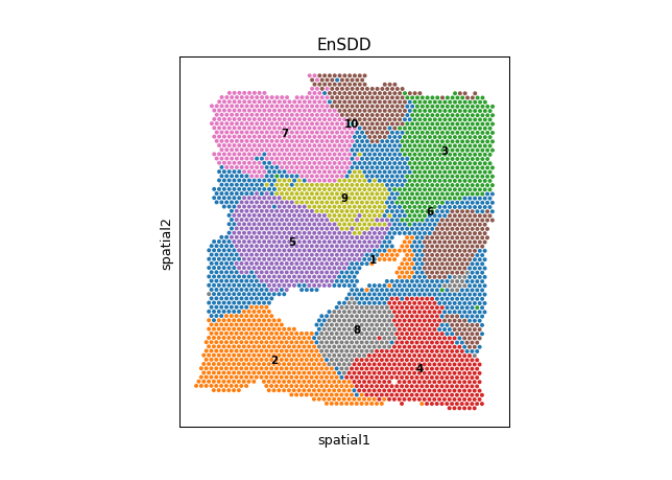
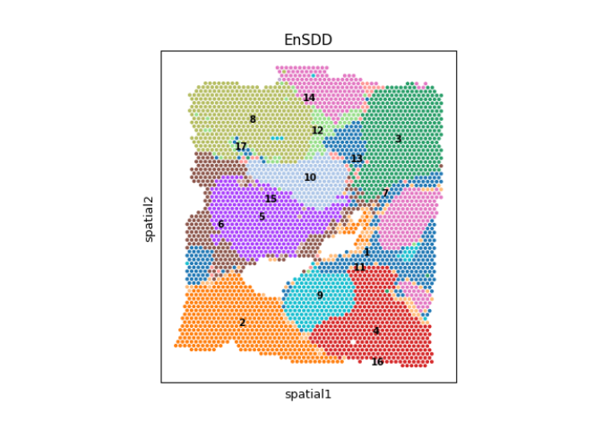
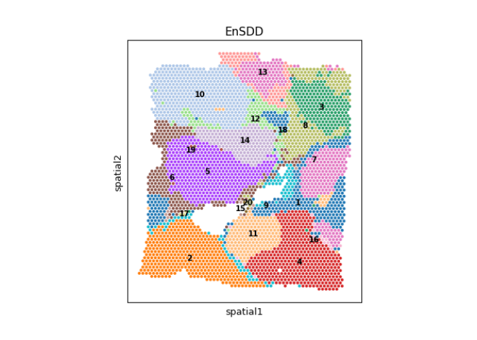
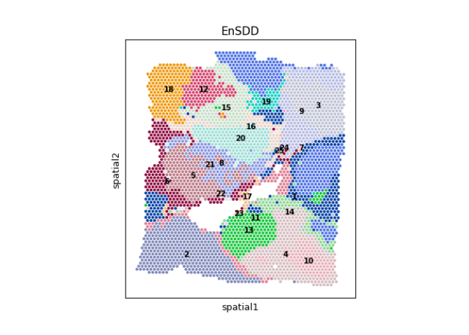
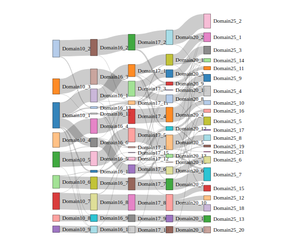
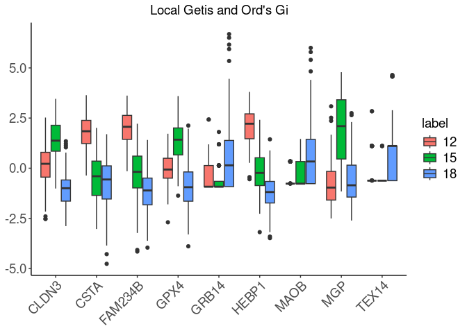
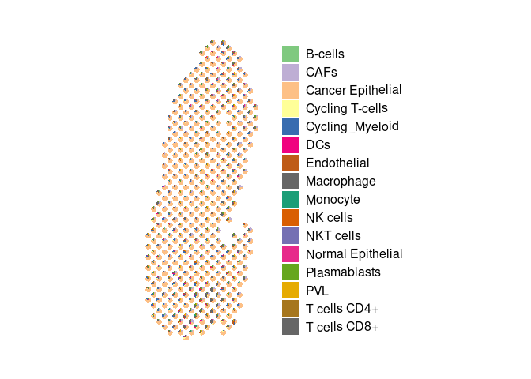
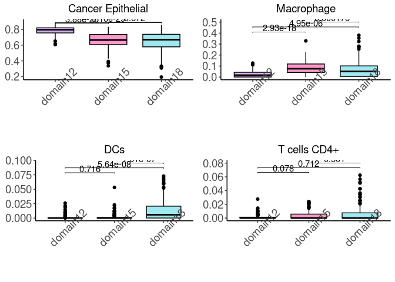

# EnSDD: Quick Start

Do you like to live in the fast lane? Do you sigh every time you see a
long vignette? Do you wish there was a TLDR on everything?

I understand.

Welcome to the EnSDD quick start!

In this vignette, we reproduce the results shown in fig 4 in the
article.

# Introduction

Intratumoral heterogeneity in cancer presents significant challenges in
developing effective treatments and often leads to poor survival
outcomes. Spatial transcriptomics is a powerful tool for examining and
characterizing this heterogeneity, providing insights into the
complexity of tumors and their interactions with immune responses. To
demonstrate the applicability of EnSDD to cancer tissue analysis, we
tested it on a human breast cancer dataset.

The experiment involves several key steps: (1) using ensemble-based
learning methods to identify spatial domains; (2) identifying
domain-specific spatially variable genes (SVGs) based on the spatial
domain information; and (3) inferring the spatial distribution of cell
types.

# Loading and Pre-processing

First, let’s load the package and the data. We focus on human breast
cancer data from 10x Visium platform. The data includes spatial gene
expression, spatial meta information and morphology image. We provide
the data at the [zenodo](https://zenodo.org/records/13621803) and the morphology image from 
[Image(TIFF)](https://www.10xgenomics.com/datasets/human-breast-cancer-block-a-section-1-1-standard-1-1-0). 
The data contains 3798 spots and 36601 genes.

``` r
suppressMessages(library(EnSDD))
#download the data and load the data
python_env <- "/home/vision/miniconda3/envs/EnSDD/bin/python"
counts_path = "/home/vision/Downloads/LHS/EnDecon/experiment/Human breast cancer/counts_matrix.txt"
loc_path = "/home/vision/Downloads/LHS/EnDecon/experiment/Human breast cancer/meta_data.txt"
img_path = "/home/vision/Downloads/LHS/EnDecon/experiment/Human breast cancer/V1_Breast_Cancer_Block_A_Section_1_image.tif"
reticulate::use_python(python_env, require = T)
reticulate::py_config()
```

    ## python:         /home/vision/miniconda3/envs/EnSDD/bin/python
    ## libpython:      /home/vision/miniconda3/envs/EnSDD/lib/libpython3.9.so
    ## pythonhome:     /home/vision/miniconda3/envs/EnSDD:/home/vision/miniconda3/envs/EnSDD
    ## version:        3.9.19 (main, May  6 2024, 19:43:03)  [GCC 11.2.0]
    ## numpy:          /home/vision/miniconda3/envs/EnSDD/lib/python3.9/site-packages/numpy
    ## numpy_version:  1.23.1
    ## 
    ## NOTE: Python version was forced by use_python() function

``` r
suppressWarnings({Seurat.data <- data_process(counts_path, loc_path, img_path, n_HVG = 2000, n_PCA = 30)})
```

# Spatial domain detection

For spatial domain detection, EnSDD initially runs eight base SDD
methods to generate multiple clustering results. For each clustering
result, a binary similarity matrix is created based on the spot labels:
if two spots belong to the same cluster, their similarity is set to 1;
otherwise, it is set to 0. Using the binary similarity matrices from the
base SDD methods, EnSDD employs an optimization model to derive a
consensus similarity matrix of spots. This model aims to simultaneously
determine the complete spatial similarity matrix between spots and the
adaptive weights assigned to each base method. These learned weights are
shown to correlate strongly with the performance of the base methods and
can be used as an evaluation metric for spatial clustering methods.
Finally, EnSDD applies the Louvain algorithm with adaptive resolution to
identify spatial domains based on the consensus similarity matrix.

``` r
## setting the number of clustering equal to the annotation provided by SEDR
library(reticulate)
reticulate::source_python(system.file("python", "Visualization_HBC_clustering.py", package = "EnSDD"))
label_setting <- c(10, 16, 17, 20, 25)
sankey_df <- list()
for (i in 1:length(label_setting)) {
  message(paste0("Setting the number of clusters: ", label_setting[i]))
  # res <- run_individual_cluster(counts_path, loc_path, img_path, python_env, n_HVG = 2000, n_PCA = 30,                         number.setting.by.user = label_setting[i],
  #                               saving_results = TRUE)
  # save(res, file = paste0("./data/res_individual_", label_setting[i], "_all.RData"))
  res.tmp <- load(paste0("../data/res_individual_", label_setting[i], "_all.RData"))
   assign("res", get(res.tmp))
  #### if the user want to integrate other SDD methods into EnSDD for ensemble, for example SiGra and spaVAE.
  ### please refer to the following guideline
  ### where the res represents the SDD results generated by EnSDD function run_individual_cluster 
  ### clustering_df represents the data frame, the row represents the samples and the column represents the labels generated by users. Cautious: the column need the names of the method setting by users. 
  ### For details, please load the data published on the Zenodo.
  #res_all <- patch_deal(res, clustering_df) 
  
  res.ensemble <- solve_ensemble(res$clustering.mat, lambda = NULL, prob.quantile = 0.5, niter = 100, epsilon = 1e-5)
  
  sim_net_louvain <- res.ensemble$H
  res.ensemble.clustering.louvain <- Louvain_clustering_binary(Seurat.data, similarity_mat = sim_net_louvain, setting_k = label_setting[i], max.res = 8)

  meta_data <- Seurat.data@meta.data
  res.vec <- res$clustering.vec
  res.vec.df <- as.data.frame(res.vec)
  res.vec.df$EnSDD <- res.ensemble.clustering.louvain[rownames(meta_data)]
  
  domain_name <- paste0('Domain_', label_setting[i])
  sankey_df[[domain_name]] <- res.ensemble.clustering.louvain[rownames(meta_data)]
  
  meta_data_all <- cbind(meta_data, res.vec.df)
  write.table(meta_data_all, file = paste0("../data/clustering.res.", label_setting[i], ".txt"), sep = "\t")
  
  meta_data_path <- paste0("../data/clustering.res.", label_setting[i], ".txt")
  visualization_clustering(counts_path, meta_data_path, img_path, cluster_num = as.integer(label_setting[i]), spot_diameter_fullres = 150, spot_size = 1.5)
# unlike('res.clustering.txt')
}
```

    ## Setting the number of clusters: 10

    ## We will adpote a value for lambda in our algorithm... 
    ## iter:  1 loss_main:  734.3313 loss_entropy:  -2.067967 loss_all:  -847.4902 lambda:  764.9161 diff 847.4902 
    ## iter:  2 loss_main:  730.9887 loss_entropy:  -2.064456 loss_all:  -848.1472 lambda:  764.9161 diff 0.6569779 
    ## iter:  3 loss_main:  730.4898 loss_entropy:  -2.0639 loss_all:  -848.2206 lambda:  764.9161 diff 0.0734733 
    ## iter:  4 loss_main:  730.4135 loss_entropy:  -2.063815 loss_all:  -848.2315 lambda:  764.9161 diff 0.01090005 
    ## iter:  5 loss_main:  730.4015 loss_entropy:  -2.063801 loss_all:  -848.2333 lambda:  764.9161 diff 0.0017407 
    ## iter:  6 loss_main:  730.3995 loss_entropy:  -2.063799 loss_all:  -848.2336 lambda:  764.9161 diff 0.0002869556 
    ## iter:  7 loss_main:  730.3992 loss_entropy:  -2.063799 loss_all:  -848.2336 lambda:  764.9161 diff 4.840594e-05 
    ## iter:  8 loss_main:  730.3992 loss_entropy:  -2.063799 loss_all:  -848.2336 lambda:  764.9161 diff 8.335607e-06

    ## Step K: 0 Louvain resolution: 4.025 Number of clusters: 267 Ideal of clusters: 10

    ## Step K: 1 Louvain resolution: 2.0375 Number of clusters: 12 Ideal of clusters: 10

    ## Step K: 2 Louvain resolution: 1.04375 Number of clusters: 6 Ideal of clusters: 10

    ## Step K: 3 Louvain resolution: 1.540625 Number of clusters: 8 Ideal of clusters: 10

    ## Step K: 4 Louvain resolution: 1.7890625 Number of clusters: 11 Ideal of clusters: 10

    ## Step K: 5 Louvain resolution: 1.66484375 Number of clusters: 8 Ideal of clusters: 10

    ## Step K: 6 Louvain resolution: 1.726953125 Number of clusters: 9 Ideal of clusters: 10

    ## Step K: 7 Louvain resolution: 1.7580078125 Number of clusters: 9 Ideal of clusters: 10

    ## Step K: 8 Louvain resolution: 1.77353515625 Number of clusters: 10 Ideal of clusters: 10

    ## [1] "Succeed to find clusters: 10 and resolution equal: 1.77353515625"

    ## Setting the number of clusters: 16

    ## We will adpote a value for lambda in our algorithm... 
    ## iter:  1 loss_main:  662.995 loss_entropy:  -2.073524 loss_all:  -681.2568 lambda:  648.2933 diff 681.2568 
    ## iter:  2 loss_main:  661.3659 loss_entropy:  -2.07152 loss_all:  -681.5864 lambda:  648.2933 diff 0.3295947 
    ## iter:  3 loss_main:  661.1173 loss_entropy:  -2.071191 loss_all:  -681.6217 lambda:  648.2933 diff 0.03534311 
    ## iter:  4 loss_main:  661.079 loss_entropy:  -2.07114 loss_all:  -681.6269 lambda:  648.2933 diff 0.005164845 
    ## iter:  5 loss_main:  661.073 loss_entropy:  -2.071132 loss_all:  -681.6277 lambda:  648.2933 diff 0.0008169762 
    ## iter:  6 loss_main:  661.072 loss_entropy:  -2.07113 loss_all:  -681.6279 lambda:  648.2933 diff 0.0001333126 
    ## iter:  7 loss_main:  661.0719 loss_entropy:  -2.07113 loss_all:  -681.6279 lambda:  648.2933 diff 2.22335e-05 
    ## iter:  8 loss_main:  661.0719 loss_entropy:  -2.07113 loss_all:  -681.6279 lambda:  648.2933 diff 3.777776e-06

    ## Step K: 0 Louvain resolution: 4.025 Number of clusters: 27 Ideal of clusters: 16

    ## Step K: 1 Louvain resolution: 2.0375 Number of clusters: 10 Ideal of clusters: 16

    ## Step K: 2 Louvain resolution: 3.03125 Number of clusters: 13 Ideal of clusters: 16

    ## Step K: 3 Louvain resolution: 3.528125 Number of clusters: 20 Ideal of clusters: 16

    ## Step K: 4 Louvain resolution: 3.2796875 Number of clusters: 16 Ideal of clusters: 16



    ## [1] "Succeed to find clusters: 16 and resolution equal: 3.2796875"

    ## Setting the number of clusters: 17

    ## We will adpote a value for lambda in our algorithm... 
    ## iter:  1 loss_main:  641.1489 loss_entropy:  -2.077156 loss_all:  -688.0717 lambda:  639.9234 diff 688.0717 
    ## iter:  2 loss_main:  640.5512 loss_entropy:  -2.076411 loss_all:  -688.1927 lambda:  639.9234 diff 0.1209328 
    ## iter:  3 loss_main:  640.4556 loss_entropy:  -2.076284 loss_all:  -688.2071 lambda:  639.9234 diff 0.01442886 
    ## iter:  4 loss_main:  640.44 loss_entropy:  -2.076263 loss_all:  -688.2094 lambda:  639.9234 diff 0.002272639 
    ## iter:  5 loss_main:  640.4373 loss_entropy:  -2.07626 loss_all:  -688.2097 lambda:  639.9234 diff 0.000385438 
    ## iter:  6 loss_main:  640.4369 loss_entropy:  -2.076259 loss_all:  -688.2098 lambda:  639.9234 diff 6.727729e-05 
    ## iter:  7 loss_main:  640.4368 loss_entropy:  -2.076259 loss_all:  -688.2098 lambda:  639.9234 diff 1.194621e-05 
    ## iter:  8 loss_main:  640.4368 loss_entropy:  -2.076259 loss_all:  -688.2098 lambda:  639.9234 diff 2.147129e-06

    ## Step K: 0 Louvain resolution: 4.025 Number of clusters: 20 Ideal of clusters: 17

    ## Step K: 1 Louvain resolution: 2.0375 Number of clusters: 10 Ideal of clusters: 17

    ## Step K: 2 Louvain resolution: 3.03125 Number of clusters: 12 Ideal of clusters: 17

    ## Step K: 3 Louvain resolution: 3.528125 Number of clusters: 15 Ideal of clusters: 17

    ## Step K: 4 Louvain resolution: 3.7765625 Number of clusters: 15 Ideal of clusters: 17

    ## Step K: 5 Louvain resolution: 3.90078125 Number of clusters: 18 Ideal of clusters: 17

    ## Step K: 6 Louvain resolution: 3.838671875 Number of clusters: 17 Ideal of clusters: 17


    ## [1] "Succeed to find clusters: 17 and resolution equal: 3.838671875"

    ## Setting the number of clusters: 20

    ## We will adpote a value for lambda in our algorithm... 
    ## iter:  1 loss_main:  610.9877 loss_entropy:  -2.076728 loss_all:  -699.1284 lambda:  630.856 diff 699.1284 
    ## iter:  2 loss_main:  610.2737 loss_entropy:  -2.075829 loss_all:  -699.2756 lambda:  630.856 diff 0.1472131 
    ## iter:  3 loss_main:  610.1596 loss_entropy:  -2.075676 loss_all:  -699.293 lambda:  630.856 diff 0.0174338 
    ## iter:  4 loss_main:  610.1412 loss_entropy:  -2.075651 loss_all:  -699.2957 lambda:  630.856 diff 0.002674404 
    ## iter:  5 loss_main:  610.1382 loss_entropy:  -2.075647 loss_all:  -699.2961 lambda:  630.856 diff 0.0004357987 
    ## iter:  6 loss_main:  610.1377 loss_entropy:  -2.075646 loss_all:  -699.2962 lambda:  630.856 diff 7.233281e-05 
    ## iter:  7 loss_main:  610.1377 loss_entropy:  -2.075646 loss_all:  -699.2962 lambda:  630.856 diff 1.212193e-05 
    ## iter:  8 loss_main:  610.1377 loss_entropy:  -2.075646 loss_all:  -699.2962 lambda:  630.856 diff 2.045467e-06

    ## Step K: 0 Louvain resolution: 4.025 Number of clusters: 15 Ideal of clusters: 20

    ## Step K: 1 Louvain resolution: 6.0125 Number of clusters: 45 Ideal of clusters: 20

    ## Step K: 2 Louvain resolution: 5.01875 Number of clusters: 27 Ideal of clusters: 20

    ## Step K: 3 Louvain resolution: 4.521875 Number of clusters: 20 Ideal of clusters: 20



    ## [1] "Succeed to find clusters: 20 and resolution equal: 4.521875"

    ## Setting the number of clusters: 25

    ## We will adpote a value for lambda in our algorithm... 
    ## iter:  1 loss_main:  572.7991 loss_entropy:  -2.074893 loss_all:  -619.8294 lambda:  574.7905 diff 619.8294 
    ## iter:  2 loss_main:  571.4965 loss_entropy:  -2.073141 loss_all:  -620.1253 lambda:  574.7905 diff 0.2958417 
    ## iter:  3 loss_main:  571.263 loss_entropy:  -2.072802 loss_all:  -620.164 lambda:  574.7905 diff 0.03869054 
    ## iter:  4 loss_main:  571.2213 loss_entropy:  -2.072741 loss_all:  -620.1705 lambda:  574.7905 diff 0.00650635 
    ## iter:  5 loss_main:  571.2137 loss_entropy:  -2.07273 loss_all:  -620.1716 lambda:  574.7905 diff 0.001164059 
    ## iter:  6 loss_main:  571.2124 loss_entropy:  -2.072728 loss_all:  -620.1719 lambda:  574.7905 diff 0.000211703 
    ## iter:  7 loss_main:  571.2121 loss_entropy:  -2.072728 loss_all:  -620.1719 lambda:  574.7905 diff 3.875835e-05 
    ## iter:  8 loss_main:  571.2121 loss_entropy:  -2.072727 loss_all:  -620.1719 lambda:  574.7905 diff 7.124941e-06

    ## Step K: 0 Louvain resolution: 4.025 Number of clusters: 16 Ideal of clusters: 25

    ## Step K: 1 Louvain resolution: 6.0125 Number of clusters: 35 Ideal of clusters: 25

    ## Step K: 2 Louvain resolution: 5.01875 Number of clusters: 22 Ideal of clusters: 25

    ## Step K: 3 Louvain resolution: 5.515625 Number of clusters: 29 Ideal of clusters: 25

    ## Step K: 4 Louvain resolution: 5.2671875 Number of clusters: 24 Ideal of clusters: 25

    ## Step K: 5 Louvain resolution: 5.39140625 Number of clusters: 27 Ideal of clusters: 25

    ## Step K: 6 Louvain resolution: 5.329296875 Number of clusters: 26 Ideal of clusters: 25

    ## Step K: 7 Louvain resolution: 5.2982421875 Number of clusters: 27 Ideal of clusters: 25

    ## Step K: 8 Louvain resolution: 5.28271484375 Number of clusters: 27 Ideal of clusters: 25

    ## Step K: 9 Louvain resolution: 5.274951171875 Number of clusters: 27 Ideal of clusters: 25

    ## Step K: 10 Louvain resolution: 5.2710693359375 Number of clusters: 28 Ideal of clusters: 25

    ## Step K: 11 Louvain resolution: 5.26912841796875 Number of clusters: 27 Ideal of clusters: 25

    ## Step K: 12 Louvain resolution: 5.26815795898438 Number of clusters: 26 Ideal of clusters: 25

    ## Step K: 13 Louvain resolution: 5.26767272949219 Number of clusters: 24 Ideal of clusters: 25

    ## Step K: 14 Louvain resolution: 5.26791534423828 Number of clusters: 25 Ideal of clusters: 25



    ## [1] "Succeed to find clusters: 25 and resolution equal: 5.26791534423828"



``` r
### plot sankey
df_sankey <- as.data.frame(sankey_df)
plot_sankey(df_sankey, filter = 5)
```


# Identifying domain-specific spatially variable genes

EnSDD provides two ways for the identifying the domain-specific SVGs:
Wilcoxon test and Local Getis and Ord’s Gi. For the human breast cancer,
we define the domain 12, 15, 18 domain-specific SVGs.

``` r
meta_data_25 <- '../data/clustering.res.25.txt'

suppressWarnings({Seurat.data <- data_process(counts_path, meta_data_25, img_path, n_HVG = 2000, n_PCA = 30)})

Seurat.data_IDC5 <- Seurat.data[, Seurat.data$ground_truth == 'IDC_5']
```

    ## Warning: Not validating Seurat objects
    ## Not validating Seurat objects
    ## Not validating Seurat objects

``` r
index.domain10_12 = c(which(Seurat.data_IDC5$EnSDD == '12'), which(Seurat.data_IDC5$EnSDD == '15'),
                      which(Seurat.data_IDC5$EnSDD == '18'))

# 
counts_ST <- as.matrix(Seurat.data@assays$SCT@counts)[, names(index.domain10_12)]
meta_data_de <- Seurat.data@meta.data[names(index.domain10_12),]

suppressWarnings({Seurat.ST.DE <- Seurat::CreateSeuratObject(counts = counts_ST, assay = "Spatial", 
                                                             meta.data = meta_data_de)})
Seurat.ST.DE <- Seurat::SCTransform(Seurat.ST.DE, assay = "Spatial", verbose = FALSE)
```

    ## Warning: useNames = NA is deprecated. Instead, specify
    ## either useNames = TRUE or useNames = FALSE.

    ## Warning: useNames = NA is deprecated. Instead, specify
    ## either useNames = TRUE or useNames = FALSE.
    ## Warning: useNames = NA is deprecated. Instead, specify
    ## either useNames = TRUE or useNames = FALSE.
    ## Warning: useNames = NA is deprecated. Instead, specify
    ## either useNames = TRUE or useNames = FALSE.
    ## Warning: useNames = NA is deprecated. Instead, specify
    ## either useNames = TRUE or useNames = FALSE.
    ## Warning: useNames = NA is deprecated. Instead, specify
    ## either useNames = TRUE or useNames = FALSE.
    ## Warning: useNames = NA is deprecated. Instead, specify
    ## either useNames = TRUE or useNames = FALSE.
    ## Warning: useNames = NA is deprecated. Instead, specify
    ## either useNames = TRUE or useNames = FALSE.
    ## Warning: useNames = NA is deprecated. Instead, specify
    ## either useNames = TRUE or useNames = FALSE.
    ## Warning: useNames = NA is deprecated. Instead, specify
    ## either useNames = TRUE or useNames = FALSE.
    ## Warning: useNames = NA is deprecated. Instead, specify
    ## either useNames = TRUE or useNames = FALSE.
    ## Warning: useNames = NA is deprecated. Instead, specify
    ## either useNames = TRUE or useNames = FALSE.
    ## Warning: useNames = NA is deprecated. Instead, specify
    ## either useNames = TRUE or useNames = FALSE.
    ## Warning: useNames = NA is deprecated. Instead, specify
    ## either useNames = TRUE or useNames = FALSE.
    ## Warning: useNames = NA is deprecated. Instead, specify
    ## either useNames = TRUE or useNames = FALSE.
    ## Warning: useNames = NA is deprecated. Instead, specify
    ## either useNames = TRUE or useNames = FALSE.
    ## Warning: useNames = NA is deprecated. Instead, specify
    ## either useNames = TRUE or useNames = FALSE.
    ## Warning: useNames = NA is deprecated. Instead, specify
    ## either useNames = TRUE or useNames = FALSE.
    ## Warning: useNames = NA is deprecated. Instead, specify
    ## either useNames = TRUE or useNames = FALSE.
    ## Warning: useNames = NA is deprecated. Instead, specify
    ## either useNames = TRUE or useNames = FALSE.
    ## Warning: useNames = NA is deprecated. Instead, specify
    ## either useNames = TRUE or useNames = FALSE.
    ## Warning: useNames = NA is deprecated. Instead, specify
    ## either useNames = TRUE or useNames = FALSE.
    ## Warning: useNames = NA is deprecated. Instead, specify
    ## either useNames = TRUE or useNames = FALSE.
    ## Warning: useNames = NA is deprecated. Instead, specify
    ## either useNames = TRUE or useNames = FALSE.

``` r
### select HVG genes
Seurat.ST.DE <- Seurat::FindVariableFeatures(Seurat.ST.DE, nfeatures = 2000, verbose = FALSE)
### PCA 
Seurat.ST.DE <- Seurat::ScaleData(Seurat.ST.DE, verbose = FALSE)
Seurat.ST.DE <- Seurat::RunPCA(Seurat.ST.DE, npcs = 20, verbose = FALSE)
### UMAP of subtype
# Seurat.ST.DE <- Seurat::RunUMAP(Seurat.ST.DE, reduction = "pca", dims = 1:20)
# p1 <- Seurat::DimPlot(Seurat.ST.DE, reduction = "umap", group.by = "EnSDD", 
#                       pt.size = 3)


labels_de <- Seurat.ST.DE@meta.data$EnSDD
res1 <- Seurat::FindMarkers(Seurat.ST.DE, ident.1 = levels(as.factor(labels_de))[1], 
                            ident.2 = levels(as.factor(labels_de))[c(2,3)], 
                            group.by = "EnSDD", test.use = "wilcox", logfc.threshold = 0.25)
res2 <-  Seurat::FindMarkers(Seurat.ST.DE, ident.1 = levels(as.factor(labels_de))[2], 
                             ident.2 = levels(as.factor(labels_de))[c(1,3)], 
                             group.by = "EnSDD", test.use = "wilcox", logfc.threshold = 0.25)
res3 <-  Seurat::FindMarkers(Seurat.ST.DE, ident.1 = levels(as.factor(labels_de))[3], 
                             ident.2 = levels(as.factor(labels_de))[c(1,2)], 
                             group.by = "EnSDD", test.use = "wilcox", logfc.threshold = 0.25)
index.de1 <- res1$p_val <= 0.05 & res1$p_val_adj <= 0.05
res.de1 <- data.frame(gene_names = toupper(row.names(res1)[index.de1]),
                     log2FC = res1$avg_log2FC[index.de1],
                     pvalue = res1$p_val[index.de1],
                     FDR = res1$p_val_adj[index.de1])
# write.table(res.de1, file = './result_patch_HBC/res.de.13.txt', sep = '\t')

index.de2 <- res2$p_val <= 0.05 & res2$p_val_adj <= 0.05
res.de2 <- data.frame(gene_names = toupper(row.names(res2)[index.de2]),
                      log2FC = res2$avg_log2FC[index.de2],
                      pvalue = res2$p_val[index.de2],
                      FDR = res2$p_val_adj[index.de2])
# write.table(res.de2, file = './result_patch_HBC/res.de.15.txt', sep = '\t')

index.de3 <- res3$p_val <= 0.05 & res3$p_val_adj <= 0.05
res.de3 <- data.frame(gene_names = toupper(row.names(res3)[index.de3]),
                      log2FC = res3$avg_log2FC[index.de3],
                      pvalue = res3$p_val[index.de3],
                      FDR = res3$p_val_adj[index.de3])
# write.table(res.de3, file = './result_patch_HBC/res.de.17.txt', sep = '\t')

### HEBP1, FAM234b, CSTA, TMSB10
Loc_G_mat <- matrix(0, nrow = ncol(Seurat.ST.DE), ncol = 9)
rownames(Loc_G_mat) <- colnames(Seurat.ST.DE)
colnames(Loc_G_mat) <- c('HEBP1', 'FAM234B', 'CSTA', 'MGP', 'CLDN3', 'GPX4', 'TEX14', 'MAOB', 'GRB14')

for (i in 1:ncol(Loc_G_mat)) {
  Loc_G_mat[,i] <- LocalG_spa(Seurat_data = Seurat.ST.DE, gene_name = colnames(Loc_G_mat)[i], k = 4)
  
}
# write.table(Loc_G_mat, file = "./result_patch_HBC/Loc_G_mat.txt", sep = "\t")

Loc_G_df <- data.frame(locG = as.vector(Loc_G_mat), 
                       gene = rep(colnames(Loc_G_mat), each = nrow(Loc_G_mat)),
                       label = as.character(rep(Seurat.ST.DE$EnSDD, time = ncol(Loc_G_mat))))
library(ggplot2)
ggplot_LocG <- ggplot(Loc_G_df, aes(x = gene, y = locG, fill = label)) + 
  geom_boxplot() +
  theme_classic()+
  labs(y="LGO's Gi", title = "Local Getis and Ord's Gi")+
  theme(
    axis.text.x.bottom = element_text(size = 14,hjust = 1,angle =45), 
    axis.text.y.left = element_text(size = 14),
    axis.title.x = element_blank(), 
    axis.title.y = element_blank(),#element_text(size = 14),
    plot.title = element_text( size=14,hjust = 0.5),
    legend.title = element_text(size = 14),
    legend.text = element_text(size = 14),
    # legend.position = "none",
    panel.grid.major = element_blank(), 
    panel.grid.minor = element_blank(),
    panel.border = element_blank(),
    axis.line = element_line(colour = "black")
  ) 
ggplot_LocG
```



``` r
# ggsave(ggplot_LocG, filename = "./result_plot/LocG_box.pdf", width = 10, height = 6)


#### enrichment analysis
# library(biomaRt)
# library(clusterProfiler)
# library(dplyr)
# library(org.Hs.eg.db)
# library(ggplot2)
# 
# DE.genes <- toupper(res.de$gene_names)
# hmark = biomaRt::useEnsembl(biomart ="ensembl", dataset = "hsapiens_gene_ensembl", mirror = "asia")
# tmp <- biomaRt::getBM(attributes = c("hgnc_symbol", "entrezgene_id"), filters = "hgnc_symbol",
#                       values = DE.genes, mart = hmark, uniqueRows = TRUE)
# 
# #### For pathway analysis 
# tmp <- dplyr::filter(tmp, entrezgene_id != "NA")
# tmp.unique <- tmp[!duplicated(tmp$hgnc_symbol),]
# rownames(res.de) <- res.de$gene_names
# res.de <- res.de[tmp.unique$hgnc_symbol,]
# res.de$gene_names <- tmp.unique$entrezgene_id
# 
# genelist <- res.de$log2FC
# names(genelist) <- res.de$gene_names
# genelist = sort(genelist, decreasing = TRUE)
# 
# ego2 <- clusterProfiler::gseGO(geneList = genelist, 
#                                ont = "BP",
#                                OrgDb = org.Hs.eg.db,
#                                pvalueCutoff = 0.05,
#                                pAdjustMethod = "BH")
# 
# # ego2 <- clusterProfiler::gseKEGG(geneList = genelist, # ordered named vector of fold changes (Entrez IDs are the associated names)
# #                                  organism = "hsa", # supported organisms listed below
# #                                  nPerm = 1000, # default number permutations
# #                                  verbose = TRUE)
# #head(ego2, 3) 
# library(enrichplot)
# library(dplyr)
# 
# 
# # %>%  barplot(x = "qscore") + xlab(expression(-log[10](FDR)))
# ### show header 9 items 
# all_items <- ego2@result[order(ego2@result$p.adjust, decreasing = FALSE), ]
# ggplot2_enrich = all_items[1:10,]
# ggplot2_enrich$log_q.value = -log10(ggplot2_enrich$p.adjust)
# tt = expression(-log[10](FDR))
# 
# ggplot2_enrich$Description <- factor(ggplot2_enrich$Description, 
#                                      levels = ggplot2_enrich$Description[order(ggplot2_enrich$log_q.value, decreasing = FALSE)])
# 
# ggplot2_enrich$ID <- factor(ggplot2_enrich$ID, 
#                             levels = ggplot2_enrich$ID[order(ggplot2_enrich$log_q.value, decreasing = FALSE)])
# 
# plot_enrich <- ggplot(data = ggplot2_enrich, aes(x = log_q.value, y = ID)) +
#   geom_bar(stat="identity", width = 0.7) +
#   theme_classic() + 
#   labs(x = tt, y = '') +
#   theme(
#     axis.text.x.bottom = element_text(size = 10),
#     axis.text.y = element_text(size = 10),
#     # axis.title.x = element_text(size = 10),
#     # axis.title.y = element_text(size = 10),
#     # axis.ticks.x = element_blank(),
#     plot.title = element_text( size=14,hjust = 0.5),
#     legend.position = "none",
#     panel.grid.major = element_blank(),
#     panel.grid.minor = element_blank(),
#     panel.border = element_blank(),
#     axis.line = element_line(colour = "black")
#   )
# plot_enrich
```

# Inferring the cell type distribution

EnSDD employs RCTD to infer the cell type composition for SRT. Given the
spatial domains and the cell type compositions in spots, EnSDD explores
the differences of cell type abundances between spatial domains, which
further dissects the cell type heterogeneity of the tissue. We use the
run.RCTD function in the spacexr R package for the inferring the cell
type abundances for the SRT data. We download the reference of human
breast cancer from GEO database
(<https://www.ncbi.nlm.nih.gov/geo/query/acc.cgi?acc=GSE176078>). 
|  Cell type   | Number of cells |
|:------------:|:---------------:|
|   B cells           |       3206      |
|   CAFs              |       6573      |
|  Cancer epithelial  |       24489     |
|  Cycling T cells    |       1528      |
|  Cycling myeloid    |       463       |
|   DCs               |       955       |
|   Endothelial       |       7605      |
|   Macrophage        |       5929      |
|   Monocyte          |       2328      |
|   NK cells          |       1864      |
|   NKT cells         |       1122      |
|  Normal epithelial  |       4355      |
|   Plasmablasts      |       3524      |
|    PVL              |       5423      |
|   T cells CD4+      |       19231     |
|   T cells CD8+      |       11487     |

``` r
load("../data/breastdata_rctd.RData")
sc_exp = breastdata_rctd$sc_exp
sc_label = breastdata_rctd$sc_lable
spot_exp = breastdata_rctd$sp_exp
spot_loc = breastdata_rctd$sp_loc

database = EnSDD::data_process_rctd(sc_exp, sc_label, spot_exp, spot_loc)
### rename the cell type for RCTD
# database$sc_label <- gsub("/", "_", database$sc_label)

rctd_res <- EnSDD::RCTD_run(database, CELL_MIN_INSTANCE = 20)
```

    ## Warning in spacexr::Reference(sparse_sc_exp, cell_types,
    ## nUMI = sc_nUMI): Reference: number of cells per cell type
    ## is 23573, larger than maximum allowable of 10000.
    ## Downsampling number of cells to: 10000

    ## 
    ##           B-cells              CAFs Cancer Epithelial 
    ##              1383              6159             10000 
    ##   Cycling T-cells   Cycling_Myeloid               DCs 
    ##              1354               438               905 
    ##       Endothelial        Macrophage          Monocyte 
    ##              7045              5466              2198 
    ##          NK cells         NKT cells Normal Epithelial 
    ##               890               423              4200 
    ##      Plasmablasts               PVL      T cells CD4+ 
    ##              1927              4850              5663 
    ##      T cells CD8+ 
    ##              4875

``` r
###### visualization of pie 
library(RColorBrewer)
library(ggplot2)
library(scatterpie)
library(cowplot)
library(gridExtra)
library(viridis)
library(rstatix)
library(ggpubr)

# load("breastdata_rctd.RData")
# load("rctd_HBC.RData")

# EnDecon_res = Results.dec.mouse[[1]]
EnDecon = rctd_res
celltype = colnames(EnDecon)
# celltype

spot_loc = breastdata_rctd$sp_loc
colnames(spot_loc) <- c("x", "y", "region")
spot_loc$region <- paste0("domain", spot_loc$region)
# data("breast.spot.annotation")
# spot_loc$region = breast.spot.annotation
spot_exp = breastdata_rctd$sp_exp

#setting the color
qual_col_pals = brewer.pal.info[brewer.pal.info$category == 'qual',]
col_vector  <-  unlist(mapply(brewer.pal, qual_col_pals$maxcolors, 
                              rownames(qual_col_pals)))
col_low <- "green"; col_high <- "red"

piedata_temp <- data.frame(x = spot_loc$x, y= spot_loc$y,
                           group =factor(1:length(spot_loc$x)))

pos_pie = as.data.frame(EnDecon)

piedata = cbind(piedata_temp,pos_pie)
##########
col_df <- data.frame(cell_types = celltype,
                     col_vector = col_vector[1:length(celltype)])

p1 = ggplot() + geom_scatterpie(aes(x=x, y=y, group=group),
                                cols= names(piedata)[-1:-3],
                                data = piedata,color=NA,
                                pie_scale = 1.3)+
  coord_equal() +theme_bw()+
  labs(y=" ",x=" ",title =" ")+
  theme(axis.ticks.x  = element_blank(), 
        axis.ticks.y  = element_blank(), 
        axis.text.x.bottom =element_blank(), 
        axis.text.y.left = element_blank(), 
        legend.text = element_text(size = 12,angle= 0.5), 
        legend.title = element_blank(), 
        panel.grid.major = element_blank(), 
        panel.grid.minor = element_blank(),
        panel.border = element_blank(),
        axis.line = element_blank())

p2 = p1 + scale_fill_manual(values = col_df$col_vector,
                            breaks = col_df$cell_types)
# save picture
#ggsave(p2 , file='pirchart.pdf',width = 7, height = 5) 
print(p2)
```



``` r
### cell type abundance in different regions
### cell type abundance in different regions
anno_type = names(table(spot_loc[,3]))
# ind_caner = which(spot_loc[,3] == anno_type[3])
domain13 = which(spot_loc[,3] == anno_type[1])
domain15 = which(spot_loc[,3] == anno_type[2]) 
domain17 = which(spot_loc[,3] == anno_type[3]) 
# immume_cell = c("B cell", "macrophage_DC_monocyte", "NK cell", "T cell")
# celltype <- immume_cell
# celltype <- colnames(EnDecon)

EnDecon_plot <- matrix(0, nrow = nrow(EnDecon), ncol = 4)
rownames(EnDecon_plot) <- rownames(EnDecon)
# colnames(EnDecon_plot) <- colnames(EnDecon)
# EnDecon_plot <- EnDecon
colnames(EnDecon_plot) <- c("Cancer Epithelial", "Macrophage", "DCs", "T cells CD4+")

EnDecon_plot[,1] <- EnDecon[,"Cancer Epithelial"]
EnDecon_plot[,2] <- EnDecon[,"Macrophage"]
EnDecon_plot[,3] <- EnDecon[,"DCs"]
EnDecon_plot[,4] <- EnDecon[,"T cells CD4+"]


# EnDecon_plot[,4] <- EnDecon[,"Cycling T-cells"]
# EnDecon_plot[,5] <- EnDecon[,"NKT cells"]
# EnDecon_plot[,6] <- EnDecon[,"NK cells"]

# EnDecon_plot[,8] <- EnDecon[,"T cells CD8+"]
# EnDecon_plot[,3] <- rowSums(EnDecon[, c("Macrophage", "DCs", "Monocyte")])
# EnDecon_plot[,4] <- EnDecon[,"NK cells"]
celltype <- colnames(EnDecon_plot)
pval = matrix(NA, length(celltype), 3)
rownames(pval) = celltype
colnames(pval) = c("domain12", 'domain15', 'domain18')
plotreg = list()
for( k in 1: length(celltype)){
  # print(k)
  cell_type_prop = EnDecon_plot[,celltype[k]]
  domain13_prop  = cell_type_prop[domain13]
  domain15_prop = cell_type_prop[domain15]
  domain17_prop = cell_type_prop[domain17]
  # immu_prop = cell_type_prop[ind_immu ]
  pval[k,1] = wilcox.test( domain13_prop ,domain15_prop)$p.value
  pval[k,2] = wilcox.test( domain13_prop ,domain17_prop)$p.value
  pval[k,3] = wilcox.test( domain15_prop ,domain17_prop)$p.value
  # pval[k,2] = wilcox.test( cancer_prop ,immu_prop )$p.value
  # pval[k,3] = wilcox.test( conn_prop ,immu_prop )$p.value
  region = c("domain12","domain15",'domain18')
  reg_lable =  rep(region,c(length(domain13_prop),
                            length(domain15_prop),
                            length(domain17_prop)))
  data_regcan = data.frame(porp = c(domain13_prop,domain15_prop,domain17_prop),
                           type = factor(reg_lable,
                                         levels = region ))
  # Wilcox test
  stat.test <- data_regcan %>%
    wilcox_test(porp ~ type) %>%
    add_significance()
  bxp <- ggboxplot(data_regcan, x = "type", y = "porp", fill = "type", 
                   palette = c("#d9b1f0", "#FF99CC", "#a1e9f0"))+
    theme_classic()+
    labs(y="",x=" ",title = celltype[k])+
    theme(
      axis.text.x.bottom = element_text(size = 14,hjust = 0.5,angle = 45), 
      axis.text.y.left = element_text(size = 14),
      axis.title.x = element_text(size = 14,hjust = 0.5, angle = 45), 
      axis.title.y = element_blank(),#element_text(size = 14),
      plot.title = element_text( size=14,hjust = 0.5),
      legend.title = element_blank(), 
      legend.position = "none",
      panel.grid.major = element_blank(), 
      panel.grid.minor = element_blank(),
      panel.border = element_blank(),
      axis.line = element_line(colour = "black")
    ) + scale_x_discrete(
      breaks = c("domain12", "domain15", "domain18"),
      label = c("domain12", "domain15", "domain18")
    )
  # Box plot
  stat.test <- stat.test %>% add_xy_position(x = "type")
  plotreg [[k]]  = bxp + stat_pvalue_manual(stat.test, label = "p", 
                                            tip.length = 0.01)
}

plotregio = plot_grid(plotlist = plotreg,nrow = 2)
plotregio
```


