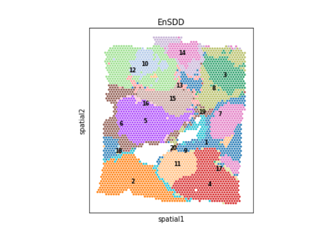
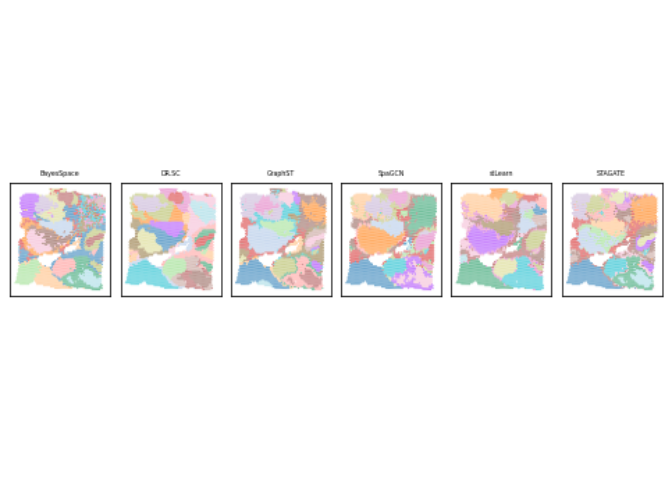
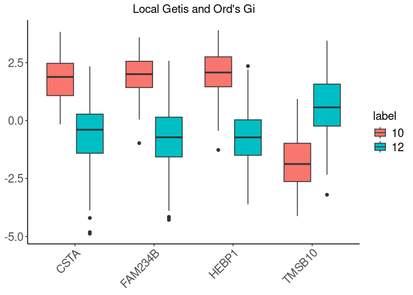
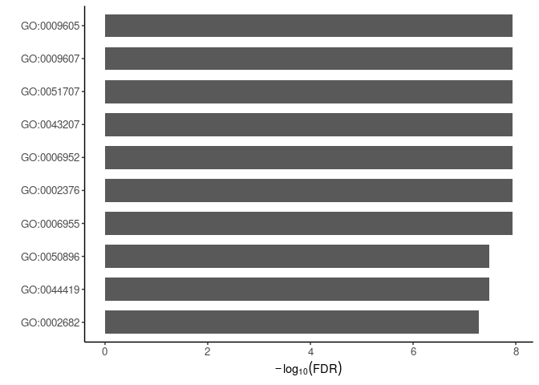
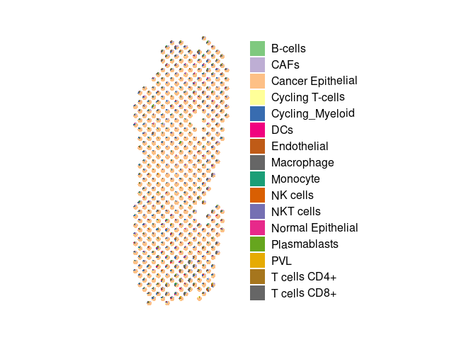
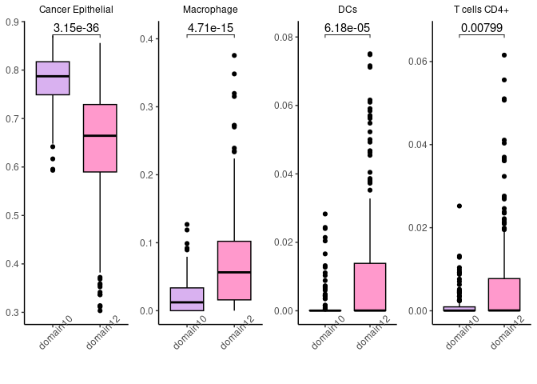

# EnSDD: Quick Start

Do you like to live in the fast lane? Do you sigh every time you see a
long vignette? Do you wish there was a TLDR on everything?

I understand.

Welcome to the EnSDD quick start!

In this vignette, we reproduce the results shown in fig 4 in the
article.

# Introduction

Intratumoral heterogeneity in cancer poses challenges for formulating
effective treatments and induces poor survival outcomes. Spatial
transcriptomics is a valuable tool for dissecting and characterizing the
heterogeneity, offering insights into both the complexity of tumor and
the interplay between tumor and immune responses. To illustrate the
generalization power on cancer tissue, we test EnSDD on the human breast
cancer dataset.

This experment includes several steps: (1) running ensemble-based
learning methods for the identification of spatial domains; (2) Based on
the spatial domains information, identifying the domain-specific SVGs;
(3) inferring the cell type spatial distribution.

# Loading and Pre-processing

First, let’s load the package and the data. We focus on human breast
cancer data from 10x Visium technology. The data includes spatial gene
expression, spatial meta information and morphology image. Please download 
the morphology image from [.tiff](https://www.10xgenomics.com/datasets/human-breast-cancer-block-a-section-1-1-standard-1-1-0). The data contains 3798 spots
and 36601 genes.

``` r
suppressMessages(library(EnSDD))
#download the data and load the data
python_env <- "~/.conda/envs/EnSDD/bin/python"
counts_path = "/home/vision/Documents/EnSDD/data/counts_matrix.txt"
loc_path = "/home/vision/Documents/EnSDD/data/meta_data.txt"
img_path = "/home/vision/Documents/EnSDD/data/V1_Breast_Cancer_Block_A_Section_1_image.tif"
reticulate::use_python(python_env, require = T)
reticulate::py_config()
```

    ## python:         /home/vision/.conda/envs/EnSDD/bin/python
    ## libpython:      /home/vision/.conda/envs/EnSDD/lib/libpython3.9.so
    ## pythonhome:     /home/vision/.conda/envs/EnSDD:/home/vision/.conda/envs/EnSDD
    ## version:        3.9.19 (main, Mar 21 2024, 17:11:28)  [GCC 11.2.0]
    ## numpy:          /home/vision/.conda/envs/EnSDD/lib/python3.9/site-packages/numpy
    ## numpy_version:  1.26.4
    ## 
    ## NOTE: Python version was forced by use_python() function

``` r
Seurat.data <- data_process(counts_path, loc_path, img_path, n_HVG = 2000, n_PCA = 30)
```

# Spatial domain detection

For the spatial domain detection, EnSDD firstly run six base SDD methods
and obtain multiple clustering results. For each clustering vector, a
binary similarity matrix is then constructed based on the corresponding
spot labels: if two spots belong to the same cluster, their similarity
is set to 1; otherwise, it is 0. Utilizing the binary similarity
matrices generated by the base SDD methods, EnSDD introduces an
optimization model to obtain a consensus similarity matrix of spots.
This model aims to simultaneously derive the fully spatial similarity
matrix between spots and the adaptive weights assigned to each base
method. These learned weights are proved to be highly correlated with
the performance of base methods, and can be further used as an
evaluation metric for base spatial clustering methods. Finally, EnSDD
introduces the Louvain algorithm with adaptive resolution for the
identification of spatial domains based on the consensus similarity
matrix of spots.

``` r
## setting the number of clustering equal to the annotation provided by SEDR
label_setting <- 20
# BayesSpace will take long time to run, don't run setting BayesSpace = FALSE
# The user could download the results of base methods that provided in the ./data/res.clustering.20.RData
# For reproducing the results, we load the .RData
# The user enable to run the run_individual_clustering function for the applying own data

# res <- run_individual_cluster(counts_path, loc_path, img_path, python_env, n_HVG = 2000, n_PCA = 30,number.setting.by.user = label_setting ,saving_results = TRUE)

load("../data/res.clustering.20.RData")

# getting the consensus matrix based on multiple binary similarity matrix
res.ensemble <- solve_ensemble(res$clustering.mat, lambda = NULL, prob.quantile = 0.5,niter = 100, epsilon = 1e-5, ncors.used = 24)
```

    ## We will adpote a value for lambda in our algorithm... 
    ## iter:  1 loss_main:  576.7397 loss_entropy:  -1.789224 loss_all:  -455.1596 lambda:  576.7301 
    ## iter:  2 loss_main:  575.744 loss_entropy:  -1.787969 loss_all:  -455.4315 lambda:  576.7301 
    ## iter:  3 loss_main:  575.5168 loss_entropy:  -1.787655 loss_all:  -455.4778 lambda:  576.7301 
    ## iter:  4 loss_main:  575.4656 loss_entropy:  -1.787583 loss_all:  -455.4874 lambda:  576.7301 
    ## iter:  5 loss_main:  575.454 loss_entropy:  -1.787567 loss_all:  -455.4896 lambda:  576.7301 
    ## iter:  6 loss_main:  575.4514 loss_entropy:  -1.787563 loss_all:  -455.4901 lambda:  576.7301 
    ## iter:  7 loss_main:  575.4508 loss_entropy:  -1.787562 loss_all:  -455.4902 lambda:  576.7301 
    ## iter:  8 loss_main:  575.4507 loss_entropy:  -1.787562 loss_all:  -455.4902 lambda:  576.7301 
    ## iter:  9 loss_main:  575.4507 loss_entropy:  -1.787562 loss_all:  -455.4902 lambda:  576.7301

``` r
# using louvain algorithm with adaptive resolution for the detection of spatial domains
res.ensemble.clustering.louvain <- Louvain_clustering(Seurat.data, similarity_mat = res.ensemble$H,setting_k = label_setting, max.res = 5, resolution_louvain = NULL, increase = 0.05)
```

    ## Louvain resolution: 0.02  Number of clusters:1

    ## Louvain resolution: 0.07  Number of clusters:3

    ## Louvain resolution: 0.12  Number of clusters:4

    ## Louvain resolution: 0.17  Number of clusters:4

    ## Louvain resolution: 0.22  Number of clusters:6

    ## Louvain resolution: 0.27  Number of clusters:7

    ## Louvain resolution: 0.32  Number of clusters:8

    ## Louvain resolution: 0.37  Number of clusters:8

    ## Louvain resolution: 0.42  Number of clusters:8

    ## Louvain resolution: 0.47  Number of clusters:8

    ## Louvain resolution: 0.52  Number of clusters:8

    ## Louvain resolution: 0.57  Number of clusters:8

    ## Louvain resolution: 0.62  Number of clusters:8

    ## Louvain resolution: 0.67  Number of clusters:8

    ## Louvain resolution: 0.72  Number of clusters:8

    ## Louvain resolution: 0.77  Number of clusters:9

    ## Louvain resolution: 0.82  Number of clusters:9

    ## Louvain resolution: 0.87  Number of clusters:9

    ## Louvain resolution: 0.92  Number of clusters:9

    ## Louvain resolution: 0.97  Number of clusters:9

    ## Louvain resolution: 1.02  Number of clusters:9

    ## Louvain resolution: 1.07  Number of clusters:9

    ## Louvain resolution: 1.12  Number of clusters:9

    ## Louvain resolution: 1.17  Number of clusters:9

    ## Louvain resolution: 1.22  Number of clusters:9

    ## Louvain resolution: 1.27  Number of clusters:9

    ## Louvain resolution: 1.32  Number of clusters:9

    ## Louvain resolution: 1.37  Number of clusters:9

    ## Louvain resolution: 1.42  Number of clusters:10

    ## Louvain resolution: 1.47  Number of clusters:10

    ## Louvain resolution: 1.52  Number of clusters:10

    ## Louvain resolution: 1.57  Number of clusters:10

    ## Louvain resolution: 1.62  Number of clusters:10

    ## Louvain resolution: 1.67  Number of clusters:10

    ## Louvain resolution: 1.72  Number of clusters:10

    ## Louvain resolution: 1.77  Number of clusters:10

    ## Louvain resolution: 1.82  Number of clusters:10

    ## Louvain resolution: 1.87  Number of clusters:10

    ## Louvain resolution: 1.92  Number of clusters:10

    ## Louvain resolution: 1.97  Number of clusters:10

    ## Louvain resolution: 2.02  Number of clusters:10

    ## Louvain resolution: 2.07  Number of clusters:10

    ## Louvain resolution: 2.12  Number of clusters:10

    ## Louvain resolution: 2.17  Number of clusters:10

    ## Louvain resolution: 2.22  Number of clusters:10

    ## Louvain resolution: 2.27  Number of clusters:10

    ## Louvain resolution: 2.32  Number of clusters:10

    ## Louvain resolution: 2.37  Number of clusters:10

    ## Louvain resolution: 2.42  Number of clusters:10

    ## Louvain resolution: 2.47  Number of clusters:10

    ## Louvain resolution: 2.52  Number of clusters:10

    ## Louvain resolution: 2.57  Number of clusters:11

    ## Louvain resolution: 2.62  Number of clusters:11

    ## Louvain resolution: 2.67  Number of clusters:11

    ## Louvain resolution: 2.72  Number of clusters:11

    ## Louvain resolution: 2.77  Number of clusters:13

    ## Louvain resolution: 2.82  Number of clusters:12

    ## Louvain resolution: 2.87  Number of clusters:11

    ## Louvain resolution: 2.92  Number of clusters:13

    ## Louvain resolution: 2.97  Number of clusters:12

    ## Louvain resolution: 3.02  Number of clusters:12

    ## Louvain resolution: 3.07  Number of clusters:14

    ## Louvain resolution: 3.12  Number of clusters:14

    ## Louvain resolution: 3.17  Number of clusters:13

    ## Louvain resolution: 3.22  Number of clusters:12

    ## Louvain resolution: 3.27  Number of clusters:13

    ## Louvain resolution: 3.32  Number of clusters:14

    ## Louvain resolution: 3.37  Number of clusters:14

    ## Louvain resolution: 3.42  Number of clusters:14

    ## Louvain resolution: 3.47  Number of clusters:13

    ## Louvain resolution: 3.52  Number of clusters:13

    ## Louvain resolution: 3.57  Number of clusters:14

    ## Louvain resolution: 3.62  Number of clusters:14

    ## Louvain resolution: 3.67  Number of clusters:15

    ## Louvain resolution: 3.72  Number of clusters:13

    ## Louvain resolution: 3.77  Number of clusters:14

    ## Louvain resolution: 3.82  Number of clusters:15

    ## Louvain resolution: 3.87  Number of clusters:13

    ## Louvain resolution: 3.92  Number of clusters:15

    ## Louvain resolution: 3.97  Number of clusters:15

    ## Louvain resolution: 4.02  Number of clusters:15

    ## Louvain resolution: 4.07  Number of clusters:16

    ## Louvain resolution: 4.12  Number of clusters:16

    ## Louvain resolution: 4.17  Number of clusters:16

    ## Louvain resolution: 4.22  Number of clusters:17

    ## Louvain resolution: 4.27  Number of clusters:16

    ## Louvain resolution: 4.32  Number of clusters:16

    ## Louvain resolution: 4.37  Number of clusters:16

    ## Louvain resolution: 4.42  Number of clusters:16

    ## Louvain resolution: 4.47  Number of clusters:20

    ## Find appropriate resolution....

``` r
### ARI and Pur values
meta_data <- Seurat.data@meta.data
res.vec <- res$clustering.vec
res.vec.df <- as.data.frame(res.vec)
res.vec.df$EnSDD <- res.ensemble.clustering.louvain[rownames(meta_data)]
meta_data_all <- cbind(meta_data, res.vec.df)

methods_names <- c(names(res$clustering.vec), "EnSDD")
ARI_res <- c()
for(i in 1:length(methods_names)){
  ari_res <- mclust::adjustedRandIndex(meta_data_all$old_fine_annot_type,    meta_data_all[[methods_names[i]]])
  ARI_res <- c(ARI_res, ari_res)
}
names(ARI_res) <- methods_names
df.bar <- data.frame(Method = methods_names, ARI = ARI_res)
library(ggplot2)
```

    ## Need help? Try Stackoverflow: https://stackoverflow.com/tags/ggplot2

``` r
title_sample <- "Human breast cancer"
error_bar = ggplot(df.bar, aes(x = Method , y = ARI,
                                  fill = Method))+
    geom_bar(stat="identity")+
    geom_text(aes(label = round(ARI, 4)), vjust=0)+
    theme_classic()+
    labs(y="ARI", x=" ", title = title_sample)+
    theme(
      axis.text.x.bottom = element_text(size = 14,hjust = 1,angle =45),
      axis.text.y.left = element_text(size = 12),
      axis.title.x = element_blank(),
      axis.title.y = element_text(size = 14),
      axis.ticks.x = element_blank(),
      plot.title = element_text( size=14,hjust = 0.5),
      legend.position = "none",
      panel.grid.major = element_blank(),
      panel.grid.minor = element_blank(),
      panel.border = element_blank(),
      axis.line = element_line(colour = "black")
    )

library(reticulate)
reticulate::source_python(system.file("python", "Visualization_HBC_clustering.py", package = "EnSDD"))
write.table(meta_data_all, file = "res.clustering.txt", sep = "\t")

visualization_clustering(counts_path, "res.clustering.txt", img_path, cluster_num = as.integer(20), spot_diameter_fullres = 150, spot_size = 1.5)
```



``` r
# visualization_clustering(counts_path, "~/data/clustering_res.20.txt", img_path, cluster_num = as.integer(20), spot_diameter_fullres = 150, spot_size = 1.5)
```

# Identifying domain-specific spatially variable genes

EnSDD provides two ways for the identifying the domain-specific SVGs:
Wilcoxon test and Local Getis and Ord’s Gi. For the human breast cancer,
we define the domain 10 and 12 domain-specific SVGs.

``` r
Seurat.data@meta.data <- meta_data_all
index.domain10_12 = Seurat.data$EnSDD == "10" | Seurat.data$EnSDD == "12"
# 
counts_ST <- as.matrix(Seurat.data@assays$SCT@counts)[, index.domain10_12]
meta_data_de <- Seurat.data@meta.data[index.domain10_12,]

suppressWarnings({Seurat.ST.DE <- Seurat::CreateSeuratObject(counts = counts_ST, assay = "Spatial", meta.data = meta_data_de)})
Seurat.ST.DE <- Seurat::SCTransform(Seurat.ST.DE, assay = "Spatial", verbose = FALSE)
  
### select HVG genes
Seurat.ST.DE <- Seurat::FindVariableFeatures(Seurat.ST.DE, nfeatures = 2000, verbose = FALSE)
### PCA 
Seurat.ST.DE <- Seurat::ScaleData(Seurat.ST.DE, verbose = FALSE)
Seurat.ST.DE <- Seurat::RunPCA(Seurat.ST.DE, npcs = 20, verbose = FALSE)
### UMAP of subtype
# Seurat.ST.DE <- Seurat::RunUMAP(Seurat.ST.DE, reduction = "pca", dims = 1:20)
# p1 <- Seurat::DimPlot(Seurat.ST.DE, reduction = "umap", group.by = "EnSDD")


labels_de <- Seurat.ST.DE@meta.data$EnSDD
res.temp <- Seurat::FindMarkers(Seurat.ST.DE, ident.1 = levels(as.factor(labels_de))[1], ident.2 = levels(as.factor(labels_de))[2], group.by = "EnSDD",test.use = "wilcox", logfc.threshold = 0.25)
```

    ## For a (much!) faster implementation of the Wilcoxon Rank Sum Test,
    ## (default method for FindMarkers) please install the presto package
    ## --------------------------------------------
    ## install.packages('devtools')
    ## devtools::install_github('immunogenomics/presto')
    ## --------------------------------------------
    ## After installation of presto, Seurat will automatically use the more 
    ## efficient implementation (no further action necessary).
    ## This message will be shown once per session

``` r
index.de <- res.temp$p_val <= 0.05 & res.temp$p_val_adj <= 0.1
res.de <- data.frame(gene_names = toupper(row.names(res.temp)[index.de]),
                     log2FC = res.temp$avg_log2FC[index.de],
                     pvalue = res.temp$p_val[index.de],
                     FDR = res.temp$p_val_adj[index.de])

### loc_G ###
### HEBP1, FAM234b, CSTA, TMSB10
Loc_G_mat <- matrix(0, nrow = ncol(Seurat.ST.DE), ncol = 4)
rownames(Loc_G_mat) <- colnames(Seurat.ST.DE)
colnames(Loc_G_mat) <- c("HEBP1", "FAM234B", "CSTA", "TMSB10")

for (i in 1:ncol(Loc_G_mat)) {
  Loc_G_mat[,i] <- EnSDD::LocalG_spa(Seurat_data = Seurat.ST.DE, gene_name = colnames(Loc_G_mat)[i], k = 4)
}
```

    ## 载入需要的程辑包：spdep

    ## 载入需要的程辑包：spData

    ## To access larger datasets in this package, install the spDataLarge package with:
    ## `install.packages('spDataLarge', repos='https://nowosad.github.io/drat/', type='source')`

    ## 载入需要的程辑包：sf

    ## Linking to GEOS 3.10.2, GDAL 3.4.1, PROJ 8.2.1; sf_use_s2() is TRUE

``` r
# write.table(Loc_G_mat, file = "Loc_G_mat.txt", sep = "\t")

Loc_G_df <- data.frame(locG = as.vector(Loc_G_mat), 
                       gene = rep(colnames(Loc_G_mat), each = nrow(Loc_G_mat)),label = as.character(rep(Seurat.ST.DE$EnSDD, time = ncol(Loc_G_mat))))
library(ggplot2)
ggplot_LocG <- ggplot(Loc_G_df, aes(x = gene, y = locG, fill = label)) + 
  geom_boxplot() +
  theme_classic()+
  labs(y="LGO's Gi", title = "Local Getis and Ord's Gi")+
  theme(
    axis.text.x.bottom = element_text(size = 14,hjust = 1,angle =45), 
    axis.text.y.left = element_text(size = 14),
    axis.title.x = element_blank(), 
    axis.title.y = element_blank(),#element_text(size = 14),
    plot.title = element_text( size=14,hjust = 0.5),
    legend.title = element_text(size = 14),
    legend.text = element_text(size = 14),
    # legend.position = "none",
    panel.grid.major = element_blank(), 
    panel.grid.minor = element_blank(),
    panel.border = element_blank(),
    axis.line = element_line(colour = "black")
  ) 

ggplot_LocG
```



``` r
# ggsave(ggplot_LocG, filename = "LocG_box.pdf", width = 6, height = 6)


#### enrichment analysis
library(biomaRt)
library(clusterProfiler)
```

    ## clusterProfiler v4.10.1  For help: https://yulab-smu.top/biomedical-knowledge-mining-book/
    ## 
    ## If you use clusterProfiler in published research, please cite:
    ## T Wu, E Hu, S Xu, M Chen, P Guo, Z Dai, T Feng, L Zhou, W Tang, L Zhan, X Fu, S Liu, X Bo, and G Yu. clusterProfiler 4.0: A universal enrichment tool for interpreting omics data. The Innovation. 2021, 2(3):100141

    ## 
    ## 载入程辑包：'clusterProfiler'

    ## The following object is masked from 'package:biomaRt':
    ## 
    ##     select

    ## The following object is masked from 'package:stats':
    ## 
    ##     filter

``` r
library(dplyr)
```

    ## 
    ## 载入程辑包：'dplyr'

    ## The following object is masked from 'package:biomaRt':
    ## 
    ##     select

    ## The following objects are masked from 'package:stats':
    ## 
    ##     filter, lag

    ## The following objects are masked from 'package:base':
    ## 
    ##     intersect, setdiff, setequal, union

``` r
library(org.Hs.eg.db)
```

    ## 载入需要的程辑包：AnnotationDbi

    ## 载入需要的程辑包：stats4

    ## 载入需要的程辑包：BiocGenerics

    ## 
    ## 载入程辑包：'BiocGenerics'

    ## The following objects are masked from 'package:dplyr':
    ## 
    ##     combine, intersect, setdiff, union

    ## The following objects are masked from 'package:stats':
    ## 
    ##     IQR, mad, sd, var, xtabs

    ## The following objects are masked from 'package:base':
    ## 
    ##     anyDuplicated, aperm, append, as.data.frame, basename, cbind, colnames, dirname, do.call,
    ##     duplicated, eval, evalq, Filter, Find, get, grep, grepl, intersect, is.unsorted, lapply,
    ##     Map, mapply, match, mget, order, paste, pmax, pmax.int, pmin, pmin.int, Position, rank,
    ##     rbind, Reduce, rownames, sapply, setdiff, sort, table, tapply, union, unique, unsplit,
    ##     which.max, which.min

    ## 载入需要的程辑包：Biobase

    ## Welcome to Bioconductor
    ## 
    ##     Vignettes contain introductory material; view with 'browseVignettes()'. To cite
    ##     Bioconductor, see 'citation("Biobase")', and for packages 'citation("pkgname")'.

    ## 载入需要的程辑包：IRanges

    ## 载入需要的程辑包：S4Vectors

    ## 
    ## 载入程辑包：'S4Vectors'

    ## The following objects are masked from 'package:dplyr':
    ## 
    ##     first, rename

    ## The following object is masked from 'package:clusterProfiler':
    ## 
    ##     rename

    ## The following object is masked from 'package:utils':
    ## 
    ##     findMatches

    ## The following objects are masked from 'package:base':
    ## 
    ##     expand.grid, I, unname

    ## 
    ## 载入程辑包：'IRanges'

    ## The following objects are masked from 'package:dplyr':
    ## 
    ##     collapse, desc, slice

    ## The following object is masked from 'package:clusterProfiler':
    ## 
    ##     slice

    ## 
    ## 载入程辑包：'AnnotationDbi'

    ## The following object is masked from 'package:dplyr':
    ## 
    ##     select

    ## The following object is masked from 'package:clusterProfiler':
    ## 
    ##     select

    ## 

``` r
library(ggplot2)

DE.genes <- toupper(res.de$gene_names)
hmark = biomaRt::useEnsembl(biomart ="ensembl", dataset = "hsapiens_gene_ensembl", mirror = "asia")
```

    ## Ensembl site unresponsive, trying www mirror

``` r
tmp <- biomaRt::getBM(attributes = c("hgnc_symbol", "entrezgene_id"), filters = "hgnc_symbol",values = DE.genes, mart = hmark, uniqueRows = TRUE)

#### For pathway analysis 
tmp <- dplyr::filter(tmp, entrezgene_id != "NA")
tmp.unique <- tmp[!duplicated(tmp$hgnc_symbol),]
rownames(res.de) <- res.de$gene_names
res.de <- res.de[tmp.unique$hgnc_symbol,]
res.de$gene_names <- tmp.unique$entrezgene_id

genelist <- res.de$log2FC
names(genelist) <- res.de$gene_names
genelist = sort(genelist, decreasing = TRUE)

ego2 <- clusterProfiler::gseGO(geneList = genelist, 
                               ont = "BP",
                               OrgDb = org.Hs.eg.db,
                               pvalueCutoff = 0.05,
                               pAdjustMethod = "BH")
```

    ## preparing geneSet collections...

    ## GSEA analysis...

    ## Warning in preparePathwaysAndStats(pathways, stats, minSize, maxSize, gseaParam, : There are ties in the preranked stats (0.61% of the list).
    ## The order of those tied genes will be arbitrary, which may produce unexpected results.

    ## Warning in fgseaMultilevel(pathways = pathways, stats = stats, minSize = minSize, : For some pathways, in
    ## reality P-values are less than 1e-10. You can set the `eps` argument to zero for better estimation.

    ## leading edge analysis...

    ## done...

``` r
# ego2 <- clusterProfiler::gseKEGG(geneList = genelist, # ordered named vector of fold changes (Entrez IDs are the associated names)
#                                  organism = "hsa", # supported organisms listed below
#                                  nPerm = 1000, # default number permutations
#                                  verbose = TRUE)
#head(ego2, 3) 
library(enrichplot)
library(dplyr)


# %>%  barplot(x = "qscore") + xlab(expression(-log[10](FDR)))
### show header 9 items 
all_items <- ego2@result[order(ego2@result$p.adjust, decreasing = FALSE), ]
ggplot2_enrich = all_items[1:10,]
ggplot2_enrich$log_q.value = -log10(ggplot2_enrich$p.adjust)
tt = expression(-log[10](FDR))

ggplot2_enrich$Description <- factor(ggplot2_enrich$Description, 
                                     levels = ggplot2_enrich$Description[order(ggplot2_enrich$log_q.value, decreasing = FALSE)])

ggplot2_enrich$ID <- factor(ggplot2_enrich$ID, 
                                     levels = ggplot2_enrich$ID[order(ggplot2_enrich$log_q.value, decreasing = FALSE)])

plot_enrich <- ggplot(data = ggplot2_enrich, aes(x = log_q.value, y = ID)) +
  geom_bar(stat="identity", width = 0.7) +
  theme_classic() + 
  labs(x = tt, y = '') +
  theme(
    axis.text.x.bottom = element_text(size = 10),
    axis.text.y = element_text(size = 10),
    # axis.title.x = element_text(size = 10),
    # axis.title.y = element_text(size = 10),
    # axis.ticks.x = element_blank(),
    plot.title = element_text( size=14,hjust = 0.5),
    legend.position = "none",
    panel.grid.major = element_blank(),
    panel.grid.minor = element_blank(),
    panel.border = element_blank(),
    axis.line = element_line(colour = "black")
)
plot_enrich
```



# Inferring the cell type distribution

EnSDD employs RCTD to infer the cell type composition for SRT. Given the
spatial domains and the cell type compositions in spots, EnSDD explores
the differences of cell type abundances between spatial domains, which
further dissects the cell type heterogeneity of the tissue. We use the
run.RCTD function in the spacexr R package for the inferring the cell
type abundances for the SRT data. We download the reference of human
breast cancer from DISCO (<https://www.immunesinglecell.org/>). \| Cell
type \| Number of cells \| \|:————:\|:—————:\| \| B cells \| 3206 \| \|
CAFs \| 6573 \| \| Cancer epithelial \| 24489 \| \| Cycling T cells \|
1528 \| \| Cycling myeloid \| 463 \| \| DCs \| 955 \| \| Endothelial \|
7605 \| \| Macrophage \| 5929 \| \| Monocyte \| 2328 \| \| NK cells \|
1864 \| \| NKT cells \| 1122 \| \| Normal epithelial \| 4355 \| \|
Plasmablasts \| 3524 \| \| PVL \| 5423 \| \| T cells CD4+ \| 19231 \| \|
T cells CD4+ \| 11487 \|

``` r
load("../data/breastdata_rctd.RData")
sc_exp = breastdata_rctd$sc_exp
sc_label = breastdata_rctd$sc_lable
spot_exp = breastdata_rctd$sp_exp
spot_loc = breastdata_rctd$sp_loc

database = EnSDD::data_process_rctd(sc_exp, sc_label, spot_exp, spot_loc)
### rename the cell type for RCTD
# database$sc_label <- gsub("/", "_", database$sc_label)

rctd_res <- EnSDD::RCTD_run(database, CELL_MIN_INSTANCE = 20)
```

    ## Warning in spacexr::Reference(sparse_sc_exp, cell_types, nUMI = sc_nUMI): Reference: number of cells per
    ## cell type is 23573, larger than maximum allowable of 10000. Downsampling number of cells to: 10000

    ## 
    ##           B-cells              CAFs Cancer Epithelial   Cycling T-cells   Cycling_Myeloid 
    ##              1383              6159             10000              1354               438 
    ##               DCs       Endothelial        Macrophage          Monocyte          NK cells 
    ##               905              7045              5466              2198               890 
    ##         NKT cells Normal Epithelial      Plasmablasts               PVL      T cells CD4+ 
    ##               423              4200              1927              4850              5663 
    ##      T cells CD8+ 
    ##              4875

``` r
###### visualization of pie 
library(RColorBrewer)
library(ggplot2)
library(scatterpie)
library(cowplot)
library(gridExtra)
```

    ## 
    ## 载入程辑包：'gridExtra'

    ## The following object is masked from 'package:Biobase':
    ## 
    ##     combine

    ## The following object is masked from 'package:BiocGenerics':
    ## 
    ##     combine

    ## The following object is masked from 'package:dplyr':
    ## 
    ##     combine

``` r
library(viridis)
```

    ## 载入需要的程辑包：viridisLite

``` r
library(rstatix)
```

    ## 
    ## 载入程辑包：'rstatix'

    ## The following object is masked from 'package:AnnotationDbi':
    ## 
    ##     select

    ## The following object is masked from 'package:IRanges':
    ## 
    ##     desc

    ## The following object is masked from 'package:biomaRt':
    ## 
    ##     select

    ## The following object is masked from 'package:stats':
    ## 
    ##     filter

``` r
library(ggpubr)
```

    ## 
    ## 载入程辑包：'ggpubr'

    ## The following object is masked from 'package:cowplot':
    ## 
    ##     get_legend

    ## The following object is masked from 'package:enrichplot':
    ## 
    ##     color_palette

``` r
# load("breastdata_rctd.RData")
# load("rctd_HBC.RData")

# EnDecon_res = Results.dec.mouse[[1]]
EnDecon = rctd_res
celltype = colnames(EnDecon)
# celltype

spot_loc = breastdata_rctd$sp_loc
colnames(spot_loc) <- c("x", "y", "region")
spot_loc$region <- paste0("domain", spot_loc$region)
# data("breast.spot.annotation")
# spot_loc$region = breast.spot.annotation
spot_exp = breastdata_rctd$sp_exp

#setting the color
qual_col_pals = brewer.pal.info[brewer.pal.info$category == 'qual',]
col_vector  <-  unlist(mapply(brewer.pal, qual_col_pals$maxcolors, 
                              rownames(qual_col_pals)))
col_low <- "green"; col_high <- "red"

piedata_temp <- data.frame(x = spot_loc$x, y= spot_loc$y,
                           group =factor(1:length(spot_loc$x)))

pos_pie = as.data.frame(EnDecon)

piedata = cbind(piedata_temp,pos_pie)
##########
col_df <- data.frame(cell_types = celltype,
                     col_vector = col_vector[1:length(celltype)])

p1 = ggplot() + geom_scatterpie(aes(x=x, y=y, group=group),
                                cols= names(piedata)[-1:-3],
                                data = piedata,color=NA,
                                pie_scale = 1.3)+
  coord_equal() +theme_bw()+
  labs(y=" ",x=" ",title =" ")+
  theme(axis.ticks.x  = element_blank(), 
        axis.ticks.y  = element_blank(), 
        axis.text.x.bottom =element_blank(), 
        axis.text.y.left = element_blank(), 
        legend.text = element_text(size = 12,angle= 0.5), 
        legend.title = element_blank(), 
        panel.grid.major = element_blank(), 
        panel.grid.minor = element_blank(),
        panel.border = element_blank(),
        axis.line = element_blank())

p2 = p1 + scale_fill_manual(values = col_df$col_vector,
                            breaks = col_df$cell_types)
# save picture
#ggsave(p2 , file='pirchart.pdf',width = 7, height = 5) 
print(p2)
```



``` r
### cell type abundance in different regions
anno_type = names(table(spot_loc[,3]))
# ind_caner = which(spot_loc[,3] == anno_type[3])
domain10 = which(spot_loc[,3] == anno_type[1])
domain12 = which(spot_loc[,3] == anno_type[2]) 
#wilcox.test()
EnDecon_plot <- matrix(0, nrow = nrow(EnDecon), ncol = 4)
rownames(EnDecon_plot) <- rownames(EnDecon)
colnames(EnDecon_plot) <- c("Cancer Epithelial", "Macrophage", "DCs", "T cells CD4+")

EnDecon_plot[,1] <- EnDecon[,"Cancer Epithelial"]
EnDecon_plot[,2] <- EnDecon[,"Macrophage"]
EnDecon_plot[,3] <- EnDecon[,"DCs"]
# EnDecon_plot[,4] <- EnDecon[,"Cycling T-cells"]
# EnDecon_plot[,5] <- EnDecon[,"NKT cells"]
# EnDecon_plot[,6] <- EnDecon[,"NK cells"]
EnDecon_plot[,4] <- EnDecon[,"T cells CD4+"]
# EnDecon_plot[,8] <- EnDecon[,"T cells CD8+"]
# EnDecon_plot[,3] <- rowSums(EnDecon[, c("Macrophage", "DCs", "Monocyte")])
# EnDecon_plot[,4] <- EnDecon[,"NK cells"]
celltype <- colnames(EnDecon_plot)
pval = matrix(NA, length(celltype), 1)
rownames(pval) = celltype
colnames(pval) = c("comparing")
plotreg = list()
for( k in 1: length(celltype)){
  # print(k)
  cell_type_prop = EnDecon[,celltype[k]]
  domain10_prop  = cell_type_prop[domain10]
  domain12_prop = cell_type_prop[domain12]
  # immu_prop = cell_type_prop[ind_immu ]
  pval[k,1] = wilcox.test( domain10_prop ,domain12_prop)$p.value
  # pval[k,2] = wilcox.test( cancer_prop ,immu_prop )$p.value
  # pval[k,3] = wilcox.test( conn_prop ,immu_prop )$p.value
  region = c("domain10","domain12")
  reg_lable =  rep(region,c(length(domain10_prop),length(domain12_prop)))
  data_regcan = data.frame(porp = c(domain10_prop, domain12_prop),
                           type = factor(reg_lable, levels = region))
  # Wilcox test
  stat.test <- data_regcan %>%
    wilcox_test(porp ~ type) %>%
    add_significance()
  bxp <- ggboxplot(data_regcan, x = "type", y = "porp", fill = "type", 
                   palette = c("#d9b1f0", "#FF99CC"))+
    theme_classic()+
    labs(y="",x=" ",title = celltype[k])+
    theme(
      axis.text.x.bottom = element_text(size = 9,hjust = 0.5,angle = 45), 
      axis.text.y.left = element_text(size = 9),
      axis.title.x = element_text(size = 9,hjust = 0.5), 
      axis.title.y = element_blank(),#element_text(size = 14),
      plot.title = element_text( size=9,hjust = 0.5),
      legend.title = element_blank(), 
      legend.position = "none",
      panel.grid.major = element_blank(), 
      panel.grid.minor = element_blank(),
      panel.border = element_blank(),
      axis.line = element_line(colour = "black")
    ) + scale_x_discrete(
      breaks = c("domain10", "domain12"),
      label = c("domain10", "domain12")
    )
  # Box plot
  stat.test <- stat.test %>% add_xy_position(x = "type")
  plotreg [[k]]  = bxp + stat_pvalue_manual(stat.test, label = "p", 
                                            tip.length = 0.01)
}

print(plot_grid(plotlist = plotreg,nrow = 1))
```


